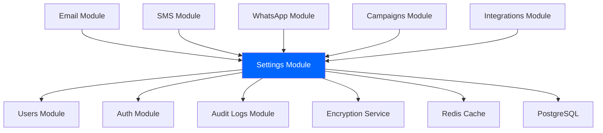

# Settings Module - Technical Specification Document
## Enterprise-Grade Configuration Management System

**Project**: Mixer - Enterprise Marketing Automation Platform  
**Module**: Settings Module (Core Infrastructure)  
**Document Type**: Technical Specification (Spec)  
**Version**: 1.0  
**Date**: 2026-09-07  
**Owner**: Tech Lead & Engineering Team  
**Status**: Draft for Review

---

## 📋 TABLE OF CONTENTS

1. [System Architecture](#system-architecture)
2. [Data Model & Database Schema](#data-model--database-schema)
3. [API Specification](#api-specification)
4. [Security & Encryption](#security--encryption)
5. [Caching Strategy](#caching-strategy)
6. [Integration Points](#integration-points)
7. [Error Handling](#error-handling)
8. [Performance Requirements](#performance-requirements)
9. [Testing Strategy](#testing-strategy)
10. [Deployment & Infrastructure](#deployment--infrastructure)
11. [Monitoring & Observability](#monitoring--observability)
12. [Implementation Plan](#implementation-plan)
13. [References](#references)

---

## 🏗️ SYSTEM ARCHITECTURE

### **High-Level Architecture**

```
┌─────────────────────────────────────────────────────────────┐
│                    Mixer Platform                            │
├─────────────────────────────────────────────────────────────┤
│                                                             │
│  ┌──────────────────────────────────────────────────────┐  │
│  │          API Gateway / Load Balancer                  │  │
│  │  - Authentication (JWT)                               │  │
│  │  - Rate Limiting                                      │  │
│  │  - Request Routing                                    │  │
│  └────────────────────┬─────────────────────────────────┘  │
│                       │                                     │
│  ┌────────────────────▼─────────────────────────────────┐  │
│  │              Settings Module (NestJS)                  │  │
│  │  ┌────────────────────────────────────────────────┐  │  │
│  │  │  Settings Controller                           │  │  │
│  │  │  - REST API endpoints                          │  │  │
│  │  │  - Input validation                            │  │  │
│  │  │  - Authentication/Authorization                │  │  │
│  │  └────────────────┬───────────────────────────────┘  │  │
│  │                   │                                   │  │
│  │  ┌────────────────▼───────────────────────────────┐  │  │
│  │  │  Settings Service                              │  │  │
│  │  │  - Business logic                              │  │  │
│  │  │  - Encryption/Decryption                       │  │  │
│  │  │  - Validation                                  │  │  │
│  │  │  - Cache management                            │  │  │
│  │  └────────────────┬───────────────────────────────┘  │  │
│  │                   │                                   │  │
│  │  ┌────────────────▼───────────────────────────────┐  │  │
│  │  │  Settings Repository                           │  │  │
│  │  │  - Data access layer                            │  │  │
│  │  │  - Query optimization                          │  │  │
│  │  │  - Transaction management                      │  │  │
│  │  └────────────────┬───────────────────────────────┘  │  │
│  │                   │                                   │  │
│  └───────────────────┼───────────────────────────────────┘  │
│                      │                                      │
│  ┌───────────────────┼───────────────────────────────────┐  │
│  │  Cache Layer      │                                     │  │
│  │  ┌────────────────▼───────────────────────────────┐  │  │
│  │  │  Redis Cluster                                  │  │  │
│  │  │  - Settings cache (TTL: 5 min)                  │  │  │
│  │  │  - Encrypted values cache                       │  │  │
│  │  └────────────────────────────────────────────────┘  │  │
│  └──────────────────────────────────────────────────────┘  │
│                                                             │
│  ┌──────────────────────────────────────────────────────┐  │
│  │  PostgreSQL Database                                 │  │
│  │  - settings table (with RLS)                         │  │
│  │  - audit_logs table                                   │  │
│  │  - Read replicas (3x)                                │  │
│  └──────────────────────────────────────────────────────┘  │
│                                                             │
└─────────────────────────────────────────────────────────────┘
```

---

### **Module Dependencies**



**Dependency Matrix**:

| Module | Dependency Type | Purpose |
|--------|----------------|---------|
| **Auth Module** | Required | JWT authentication, user context |
| **Users Module** | Required | User management, role validation |
| **Audit Logs** | Required | Compliance, change tracking |
| **Encryption Service** | Required | AES-256 encryption for sensitive data |
| **Redis** | Optional | Caching (performance optimization) |
| **PostgreSQL** | Required | Persistent storage |

---

### **Component Architecture**

```
Settings Module Components:

1. SettingsController
   - HTTP endpoint handlers
   - Request/response mapping
   - Input validation (class-validator)
   - Authorization checks

2. SettingsService
   - Business logic orchestration
   - Encryption/decryption
   - Cache management
   - Validation rules
   - Default values management

3. SettingsRepository
   - Data access layer
   - Query optimization
   - Transaction management
   - Multi-tenant isolation

4. EncryptionService
   - AES-256-GCM encryption
   - Key management
   - Encrypt/decrypt operations

5. CacheService
   - Redis integration
   - Cache invalidation
   - TTL management

6. AuditService
   - Audit log creation
   - Change tracking
```

---

## 💾 DATA MODEL & DATABASE SCHEMA

### **Entity Relationship Diagram**

```
┌─────────────────────────────────────────────────────────────┐
│                      Database Schema                         │
├─────────────────────────────────────────────────────────────┤
│                                                             │
│  ┌──────────────┐                                          │
│  │   settings   │                                          │
│  ├──────────────┤                                          │
│  │ id (PK)      │ UUID                                      │
│  │ tenant_id    │ VARCHAR(255)                              │
│  │ category     │ VARCHAR(50)                               │
│  │ key          │ VARCHAR(100)                              │
│  │ value        │ JSONB                                     │
│  │ is_encrypted │ BOOLEAN                                   │
│  │ description  │ TEXT                                      │
│  │ created_at   │ TIMESTAMP                                 │
│  │ updated_at   │ TIMESTAMP                                 │
│  │ deleted_at   │ TIMESTAMP (soft delete)                   │
│  └──────┬───────┘                                          │
│         │                                                   │
│         │ N                                                 │
│         │                                                   │
│  ┌──────▼──────────────────┐                                │
│  │     audit_logs          │                                │
│  ├─────────────────────────┤                                │
│  │ id (PK)                 │ UUID                           │
│  │ tenant_id               │ VARCHAR(255)                   │
│  │ user_id                 │ VARCHAR(255)                   │
│  │ action                  │ VARCHAR(50)                    │
│  │ resource_type           │ VARCHAR(50)                    │
│  │ resource_id             │ VARCHAR(255)                   │
│  │ old_values              │ JSONB                          │
│  │ new_values              │ JSONB                          │
│  │ ip_address              │ VARCHAR(45)                    │
│  │ user_agent              │ TEXT                           │
│  │ timestamp               │ TIMESTAMP                      │
│  └─────────────────────────┘                                │
│                                                             │
└─────────────────────────────────────────────────────────────┘
```

---

### **TypeORM Entity Definition**

```typescript
// entities/settings.entity.ts
import {
  Entity,
  PrimaryGeneratedColumn,
  Column,
  CreateDateColumn,
  UpdateDateColumn,
  DeleteDateColumn,
  Index,
} from 'typeorm';
import { TenantEntity } from '../../common/entities/tenant.entity';

export enum SettingCategory {
  GENERAL = 'general',
  EMAIL = 'email',
  SMS = 'sms',
  WHATSAPP = 'whatsapp',
  SECURITY = 'security',
  NOTIFICATIONS = 'notifications',
  BRANDING = 'branding',
  INTEGRATIONS = 'integrations',
}

@Entity('settings')
@Index(['tenantId', 'category'])
@Index(['tenantId', 'key'])
@Index(['category', 'key'])
export class Settings extends TenantEntity {
  @Column({
    name: 'category',
    type: 'varchar',
    length: 50,
  })
  category: SettingCategory;

  @Column({
    name: 'key',
    type: 'varchar',
    length: 100,
  })
  key: string;

  @Column({
    name: 'value',
    type: 'jsonb',
  })
  value: Record<string, any>;

  @Column({
    name: 'is_encrypted',
    type: 'boolean',
    default: false,
  })
  isEncrypted: boolean;

  @Column({
    name: 'description',
    type: 'text',
    nullable: true,
  })
  description: string;

  @CreateDateColumn({
    name: 'created_at',
  })
  createdAt: Date;

  @UpdateDateColumn({
    name: 'updated_at',
  })
  updatedAt: Date;

  @DeleteDateColumn({
    name: 'deleted_at',
    nullable: true,
  })
  deletedAt: Date | null;
}
```

---

### **Database Schema (PostgreSQL)**

```sql
-- Enable extensions
CREATE EXTENSION IF NOT EXISTS "uuid-ossp";
CREATE EXTENSION IF NOT EXISTS "pgcrypto"; -- For encryption

-- Settings table
CREATE TABLE IF NOT EXISTS settings (
  id UUID DEFAULT uuid_generate_v4() PRIMARY KEY,
  tenant_id VARCHAR(255) NOT NULL,
  category VARCHAR(50) NOT NULL,
  key VARCHAR(100) NOT NULL,
  value JSONB NOT NULL,
  is_encrypted BOOLEAN DEFAULT FALSE,
  description TEXT,
  created_at TIMESTAMP NOT NULL DEFAULT CURRENT_TIMESTAMP,
  updated_at TIMESTAMP NOT NULL DEFAULT CURRENT_TIMESTAMP,
  deleted_at TIMESTAMP,
  
  -- Constraints
  CONSTRAINT chk_settings_category 
    CHECK (category IN (
      'general', 'email', 'sms', 'whatsapp', 
      'security', 'notifications', 'branding', 'integrations'
    ))
);

-- Indexes
CREATE INDEX idx_settings_tenant_id ON settings(tenant_id);
CREATE INDEX idx_settings_category ON settings(category);
CREATE INDEX idx_settings_tenant_category ON settings(tenant_id, category);
CREATE UNIQUE INDEX idx_settings_tenant_category_key 
  ON settings(tenant_id, category, key) 
  WHERE deleted_at IS NULL;

-- Row Level Security (RLS)
ALTER TABLE settings ENABLE ROW LEVEL SECURITY;

CREATE POLICY tenant_isolation_settings ON settings
  USING (tenant_id = current_setting('app.current_tenant_id', TRUE));

-- Trigger for updated_at
CREATE OR REPLACE FUNCTION update_settings_updated_at()
RETURNS TRIGGER AS $$
BEGIN
  NEW.updated_at = CURRENT_TIMESTAMP;
  RETURN NEW;
END;
$$ LANGUAGE plpgsql;

CREATE TRIGGER trigger_settings_updated_at
  BEFORE UPDATE ON settings
  FOR EACH ROW
  EXECUTE FUNCTION update_settings_updated_at();

-- Audit logs table
CREATE TABLE IF NOT EXISTS audit_logs (
  id UUID DEFAULT uuid_generate_v4() PRIMARY KEY,
  tenant_id VARCHAR(255) NOT NULL,
  user_id VARCHAR(255),
  action VARCHAR(50) NOT NULL,
  resource_type VARCHAR(50) NOT NULL,
  resource_id VARCHAR(255) NOT NULL,
  old_values JSONB,
  new_values JSONB,
  ip_address VARCHAR(45),
  user_agent TEXT,
  timestamp TIMESTAMP NOT NULL DEFAULT CURRENT_TIMESTAMP
);

CREATE INDEX idx_audit_logs_tenant_id ON audit_logs(tenant_id);
CREATE INDEX idx_audit_logs_timestamp ON audit_logs(timestamp);
CREATE INDEX idx_audit_logs_resource ON audit_logs(resource_type, resource_id);
```

---

### **Repository Interface**

```typescript
// interfaces/settings.repository.interface.ts
export interface ISettingsRepository {
  /**
   * Find setting by tenant, category, and key
   */
  findByTenantCategoryAndKey(
    tenantId: string,
    category: SettingCategory,
    key: string,
  ): Promise<Settings | null>;

  /**
   * Find all settings by tenant and category
   */
  findByTenantAndCategory(
    tenantId: string,
    category: SettingCategory,
  ): Promise<Settings[]>;

  /**
   * Find all categories for a tenant
   */
  findCategoriesByTenant(tenantId: string): Promise<string[]>;

  /**
   * Create new setting
   */
  create(setting: Partial<Settings>): Promise<Settings>;

  /**
   * Update setting
   */
  update(id: string, partial: Partial<Settings>): Promise<Settings>;

  /**
   * Soft delete setting
   */
  softDelete(id: string): Promise<void>;

  /**
   * Check if setting exists
   */
  exists(tenantId: string, category: SettingCategory, key: string): Promise<boolean>;
}
```

---

## 🌐 API SPECIFICATION

### **REST API Endpoints**

#### **1. Get All Categories**
```http
GET /api/v1/settings/categories
Authorization: Bearer {jwt_token}
```

**Response**:
```json
{
  "data": [
    "general",
    "email",
    "sms",
    "whatsapp",
    "security",
    "notifications",
    "branding",
    "integrations"
  ],
  "meta": {
    "total": 8
  }
}
```

---

#### **2. Get Settings by Category**
```http
GET /api/v1/settings/:category
Authorization: Bearer {jwt_token}
X-Tenant-ID: {tenant_id}
```

**Response**:
```json
{
  "data": {
    "smtp": {
      "host": "smtp.sendgrid.net",
      "port": 587,
      "username": "apikey",
      "password": "SG.encrypted_value_here",
      "encryption": "tls"
    },
    "from": {
      "name": "Acme Corp",
      "email": "noreply@acme.com",
      "replyTo": "support@acme.com"
    }
  },
  "meta": {
    "category": "email",
    "lastUpdated": "2026-09-07T10:30:00Z",
    "updatedBy": "user_123"
  }
}
```

---

#### **3. Get Single Setting**
```http
GET /api/v1/settings/:category/:key
Authorization: Bearer {jwt_token}
X-Tenant-ID: {tenant_id}
```

**Response**:
```json
{
  "data": {
    "key": "smtp",
    "value": {
      "host": "smtp.sendgrid.net",
      "port": 587,
      "username": "apikey",
      "password": "SG.encrypted_value_here",
      "encryption": "tls"
    },
    "isEncrypted": true,
    "description": "SMTP configuration for sending emails"
  }
}
```

---

#### **4. Update Settings (Bulk)**
```http
PATCH /api/v1/settings/:category
Authorization: Bearer {jwt_token}
X-Tenant-ID: {tenant_id}
Content-Type: application/json
```

**Request Body**:
```json
{
  "smtp": {
    "host": "smtp.sendgrid.net",
    "port": 587,
    "username": "apikey",
    "password": "new_secure_password",
    "encryption": "tls"
  },
  "from": {
    "name": "Acme Corp",
    "email": "noreply@acme.com",
    "replyTo": "support@acme.com"
  }
}
```

**Response**:
```json
{
  "data": {
    "updated": 2,
    "created": 0,
    "category": "email"
  },
  "meta": {
    "updatedAt": "2026-09-07T10:35:00Z",
    "updatedBy": "user_123"
  }
}
```

---

#### **5. Initialize Default Settings**
```http
POST /api/v1/settings/:category/initialize
Authorization: Bearer {jwt_token}
X-Tenant-ID: {tenant_id}
```

**Response**:
```json
{
  "data": {
    "category": "email",
    "initialized": true,
    "count": 5
  }
}
```

---

#### **6. Delete Setting**
```http
DELETE /api/v1/settings/:category/:key
Authorization: Bearer {jwt_token}
X-Tenant-ID: {tenant_id}
```

**Response**:
```json
{
  "data": {
    "deleted": true,
    "category": "email",
    "key": "smtp"
  }
}
```

---

### **API Error Responses**

```json
{
  "error": {
    "code": "SETTINGS_NOT_FOUND",
    "message": "Setting email.smtp not found",
    "statusCode": 404,
    "timestamp": "2026-09-07T10:30:00Z",
    "path": "/api/v1/settings/email/smtp"
  }
}
```

**Error Codes**:

| Code | HTTP Status | Description |
|------|-------------|-------------|
| `SETTINGS_NOT_FOUND` | 404 | Setting does not exist |
| `SETTINGS_ALREADY_INITIALIZED` | 409 | Settings already initialized |
| `SETTINGS_INVALID_FORMAT` | 400 | Invalid settings format |
| `SETTINGS_ENCRYPTION_FAILED` | 500 | Encryption failed |
| `SETTINGS_PERMISSION_DENIED` | 403 | Insufficient permissions |
| `SETTINGS_TENANT_MISMATCH` | 403 | Tenant ID mismatch |

---

## 🔐 SECURITY & ENCRYPTION

### **Encryption Architecture**

```
┌─────────────────────────────────────────────────────────────┐
│                  Encryption Flow                             │
├─────────────────────────────────────────────────────────────┤
│                                                             │
│  WRITE PATH:                                               │
│  ┌──────────┐    ┌──────────┐    ┌──────────┐            │
│  │  Input   │───▶│ Encrypt  │───▶│ Encrypted│            │
│  │ (Plain)  │    │ (AES-256)│    │  Value   │            │
│  └──────────┘    └──────────┘    └──────────┘            │
│                                          │                 │
│                                          ▼                 │
│                                   ┌──────────┐            │
│                                   │  Store   │            │
│                                   │ in DB    │            │
│                                   └──────────┘            │
│                                                             │
│  READ PATH:                                                │
│  ┌──────────┐    ┌──────────┐    ┌──────────┐            │
│  │  Read    │───▶│ Decrypt  │───▶│  Plain   │            │
│  │ Encrypted│    │ (AES-256)│    │   Value  │            │
│  └──────────┘    └──────────┘    └──────────┘            │
│                                                             │
└─────────────────────────────────────────────────────────────┘
```

---

### **Encryption Service Implementation**

```typescript
// services/encryption.service.ts
import { Injectable, InternalServerErrorException } from '@nestjs/common';
import * as crypto from 'crypto';

export interface EncryptedData {
  encrypted: string;
  iv: string;
  authTag: string;
}

@Injectable()
export class EncryptionService {
  private readonly algorithm = 'aes-256-gcm';
  private readonly keyLength = 32; // 256 bits
  private readonly ivLength = 16; // 128 bits
  private readonly authTagLength = 16; // 128 bits

  private masterKey: Buffer;

  constructor() {
    // Load master key from environment or AWS Secrets Manager
    const keyHex = process.env.ENCRYPTION_KEY;
    if (!keyHex) {
      throw new Error('ENCRYPTION_KEY environment variable not set');
    }
    
    this.masterKey = Buffer.from(keyHex, 'hex');
    
    if (this.masterKey.length !== this.keyLength) {
      throw new Error(`Encryption key must be ${this.keyLength} bytes`);
    }
  }

  /**
   * Encrypt plaintext data
   */
  encrypt(plaintext: string): EncryptedData {
    try {
      // Generate random IV
      const iv = crypto.randomBytes(this.ivLength);
      
      // Create cipher
      const cipher = crypto.createCipheriv(
        this.algorithm,
        this.masterKey,
        iv,
      );

      // Encrypt
      let encrypted = cipher.update(plaintext, 'utf8', 'hex');
      encrypted += cipher.final('hex');

      // Get auth tag
      const authTag = cipher.getAuthTag();

      return {
        encrypted,
        iv: iv.toString('hex'),
        authTag: authTag.toString('hex'),
      };
    } catch (error) {
      throw new InternalServerErrorException('Encryption failed');
    }
  }

  /**
   * Decrypt encrypted data
   */
  decrypt(data: EncryptedData): string {
    try {
      // Create decipher
      const decipher = crypto.createDecipheriv(
        this.algorithm,
        this.masterKey,
        Buffer.from(data.iv, 'hex'),
      );

      // Set auth tag
      decipher.setAuthTag(Buffer.from(data.authTag, 'hex'));

      // Decrypt
      let decrypted = decipher.update(data.encrypted, 'hex', 'utf8');
      decrypted += decipher.final('utf8');

      return decrypted;
    } catch (error) {
      throw new InternalServerErrorException('Decryption failed');
    }
  }

  /**
   * Encrypt object (JSON)
   */
  encryptObject(obj: Record<string, any>): EncryptedData {
    return this.encrypt(JSON.stringify(obj));
  }

  /**
   * Decrypt object (JSON)
   */
  decryptObject(data: EncryptedData): Record<string, any> {
    const decrypted = this.decrypt(data);
    return JSON.parse(decrypted);
  }

  /**
   * Rotate encryption key (re-encrypt with new key)
   */
  async rotateKey(oldKey: Buffer, newKey: Buffer): Promise<void> {
    // Implementation for key rotation
    // 1. Decrypt all values with old key
    // 2. Re-encrypt with new key
    // 3. Update database
  }
}
```

---

### **Encryption Key Management**

```yaml
Key Management Strategy:

Development:
  - Key stored in .env file
  - Key: 64-character hex string (32 bytes)
  - Example: ENCRYPTION_KEY=a1b2c3d4e5f6... (64 chars)

Staging:
  - Key stored in AWS Secrets Manager
  - Key rotated every 90 days
  - Separate key from production

Production:
  - Key stored in AWS Secrets Manager / HashiCorp Vault
  - Key rotated every 90 days
  - Automatic rotation without downtime
  - Multiple key versions supported
  - Audit logging for key access

Key Generation:
  - Use cryptographically secure random generator
  - Command: openssl rand -hex 32
  - Never hardcode keys in source code
  - Never commit keys to git
```

---

### **Multi-Tenant Isolation**

```typescript
// Tenant context middleware
@Injectable()
export class TenantMiddleware implements NestMiddleware {
  use(req: Request, res: Response, next: NextFunction) {
    // Extract tenant ID from JWT or header
    const tenantId = req.user?.tenantId || req.headers['x-tenant-id'];
    
    if (!tenantId) {
      throw new BadRequestException('Tenant ID required');
    }

    // Set tenant context in request
    req.tenantId = tenantId;

    // Set PostgreSQL session variable for RLS
    if (req.dbConnection) {
      req.dbConnection.query(
        "SET app.current_tenant_id = $1",
        [tenantId],
      );
    }

    next();
  }
}

// Repository with automatic tenant isolation
@Injectable()
export class SettingsRepository {
  async findByTenantAndCategory(
    tenantId: string,
    category: SettingCategory,
  ): Promise<Settings[]> {
    // RLS automatically filters by tenant_id
    return this.createQueryBuilder('setting')
      .where('setting.tenantId = :tenantId', { tenantId })
      .andWhere('setting.category = :category', { category })
      .andWhere('setting.deletedAt IS NULL')
      .getMany();
  }
}
```

---

## 🚀 CACHING STRATEGY

### **Cache Architecture**

```
┌─────────────────────────────────────────────────────────────┐
│                    Cache Strategy                            │
├─────────────────────────────────────────────────────────────┤
│                                                             │
│  READ PATH:                                                │
│  Request ──▶ Check Cache ──▶ Hit? Return                  │
│                    │                                       │
│                    └──▶ Miss ──▶ Query DB ──▶ Store in Cache│
│                                                             │
│  WRITE PATH:                                               │
│  Update ──▶ Update DB ──▶ Invalidate Cache                 │
│                                                             │
│  CACHE TTL: 5 minutes                                      │
│  CACHE KEY: settings:{tenantId}:{category}                 │
│                                                             │
└─────────────────────────────────────────────────────────────┘
```

---

### **Cache Implementation**

```typescript
// services/cache.service.ts
@Injectable()
export class CacheService {
  constructor(
    @Inject('REDIS_CLIENT') private readonly redis: Redis,
  ) {}

  /**
   * Get cached settings
   */
  async get(tenantId: string, category: string): Promise<any> {
    const key = this.buildKey(tenantId, category);
    const cached = await this.redis.get(key);
    
    if (cached) {
      return JSON.parse(cached);
    }
    
    return null;
  }

  /**
   * Set cache
   */
  async set(tenantId: string, category: string, data: any, ttl: number = 300): Promise<void> {
    const key = this.buildKey(tenantId, category);
    await this.redis.setex(key, ttl, JSON.stringify(data));
  }

  /**
   * Invalidate cache
   */
  async invalidate(tenantId: string, category?: string): Promise<void> {
    if (category) {
      // Invalidate specific category
      const key = this.buildKey(tenantId, category);
      await this.redis.del(key);
    } else {
      // Invalidate all settings for tenant
      const pattern = `settings:${tenantId}:*`;
      const keys = await this.redis.keys(pattern);
      if (keys.length > 0) {
        await this.redis.del(keys);
      }
    }
  }

  /**
   * Build cache key
   */
  private buildKey(tenantId: string, category: string): string {
    return `settings:${tenantId}:${category}`;
  }
}
```

---

### **Cache Integration in Service**

```typescript
// services/settings.service.ts
@Injectable()
export class SettingsService {
  constructor(
    private readonly settingsRepository: SettingsRepository,
    private readonly cacheService: CacheService,
    private readonly encryptionService: EncryptionService,
  ) {}

  async getByCategory(tenantId: string, category: SettingCategory) {
    // Try cache first
    let settings = await this.cacheService.get(tenantId, category);
    
    if (!settings) {
      // Cache miss - query database
      const entities = await this.settingsRepository.findByTenantAndCategory(
        tenantId,
        category,
      );
      
      // Transform to key-value object
      settings = {};
      for (const entity of entities) {
        let value = entity.value;
        if (entity.isEncrypted) {
          value = this.encryptionService.decryptObject(value);
        }
        settings[entity.key] = value;
      }
      
      // Store in cache
      await this.cacheService.set(tenantId, category, settings);
    }
    
    return settings;
  }

  async updateCategory(tenantId: string, category: SettingCategory, updates: any) {
    // Update database
    await this.settingsRepository.updateCategory(tenantId, category, updates);
    
    // Invalidate cache
    await this.cacheService.invalidate(tenantId, category);
  }
}
```

---

## 🔌 INTEGRATION POINTS

### **Module Integration**

```typescript
// Email Module uses Settings
@Injectable()
export class EmailService {
  constructor(
    private readonly settingsService: SettingsService,
  ) {}

  async sendEmail(to: string, subject: string, body: string) {
    // Get email settings from Settings Module
    const emailSettings = await this.settingsService.getByCategory(
      this.tenantId,
      SettingCategory.EMAIL,
    );
    
    const smtpSettings = emailSettings.smtp;
    const fromSettings = emailSettings.from;
    
    // Use settings to send email
    const transporter = nodemailer.createTransport({
      host: smtpSettings.host,
      port: smtpSettings.port,
      secure: smtpSettings.encryption === 'ssl',
      auth: {
        user: smtpSettings.username,
        pass: this.encryptionService.decrypt(smtpSettings.password),
      },
    });
    
    await transporter.sendMail({
      from: `${fromSettings.name} <${fromSettings.email}>`,
      to,
      subject,
      body,
    });
  }
}
```

---

### **Settings Initialization on Tenant Creation**

```typescript
// tenant.service.ts
@Injectable()
export class TenantService {
  constructor(
    private readonly settingsService: SettingsService,
    private readonly userService: UserService,
  ) {}

  async createTenant(dto: CreateTenantDto): Promise<Tenant> {
    // 1. Create tenant
    const tenant = await this.tenantRepository.create(dto);
    
    // 2. Initialize default settings
    await this.settingsService.initializeDefaults(tenant.id);
    
    // 3. Create admin user
    await this.userService.createAdminUser(tenant.id, dto.adminEmail);
    
    // 4. Send welcome email
    await this.emailService.sendWelcomeEmail(tenant.id);
    
    return tenant;
  }
}
```

---

## ⚠️ ERROR HANDLING

### **Error Codes & Messages**

```typescript
export enum SettingsErrorCodes {
  SETTINGS_NOT_FOUND = 'SETTINGS_NOT_FOUND',
  SETTINGS_ALREADY_INITIALIZED = 'SETTINGS_ALREADY_INITIALIZED',
  SETTINGS_INVALID_FORMAT = 'SETTINGS_INVALID_FORMAT',
  SETTINGS_ENCRYPTION_FAILED = 'SETTINGS_ENCRYPTION_FAILED',
  SETTINGS_PERMISSION_DENIED = 'SETTINGS_PERMISSION_DENIED',
  SETTINGS_TENANT_MISMATCH = 'SETTINGS_TENANT_MISMATCH',
  SETTINGS_CATEGORY_NOT_FOUND = 'SETTINGS_CATEGORY_NOT_FOUND',
  SETTINGS_VALIDATION_FAILED = 'SETTINGS_VALIDATION_FAILED',
}

// Custom exceptions
export class SettingsNotFoundException extends NotFoundException {
  constructor(category: string, key: string) {
    super(`Setting ${category}.${key} not found`);
    this.name = 'SettingsNotFoundException';
  }
}

export class SettingsEncryptionException extends InternalServerErrorException {
  constructor() {
    super('Encryption failed');
    this.name = 'SettingsEncryptionException';
  }
}
```

---

### **Error Handling Middleware**

```typescript
// exceptions/settings-exception.filter.ts
@Catch(SettingsException)
export class SettingsExceptionFilter implements ExceptionFilter {
  catch(exception: SettingsException, host: ArgumentsHost) {
    const ctx = host.switchToHttp();
    const response = ctx.getResponse();
    const request = req.getRequest();

    const errorResponse = {
      error: {
        code: exception.name,
        message: exception.message,
        statusCode: exception.getStatus(),
        timestamp: new Date().toISOString(),
        path: request.url,
      },
    };

    response.status(exception.getStatus()).json(errorResponse);
  }
}
```

---

## ⚡ PERFORMANCE REQUIREMENTS

### **Performance Targets**

| Metric | Target | Measurement |
|--------|--------|-------------|
| **API Response Time (p95)** | <100ms | GET /settings/:category |
| **API Response Time (p95)** | <100ms | PATCH /settings/:category |
| **Database Query Time** | <20ms | Indexed queries |
| **Cache Hit Rate** | >80% | Redis cache |
| **Concurrent Requests** | 1000 req/s | Load testing |
| **Database Connections** | <20 | Connection pool |

---

### **Performance Optimization**

```typescript
// 1. Database Indexing
CREATE INDEX idx_settings_tenant_category ON settings(tenant_id, category);
CREATE INDEX idx_settings_tenant_category_key ON settings(tenant_id, category, key);

-- 2. Query Optimization
// Use SELECT only needed columns
const settings = await this.settingsRepository
  .createQueryBuilder('setting')
  .select(['setting.key', 'setting.value', 'setting.isEncrypted'])
  .where('setting.tenantId = :tenantId', { tenantId })
  .andWhere('setting.category = :category', { category })
  .getMany();

// 3. Caching (Redis)
// Cache TTL: 5 minutes
const CACHE_TTL = 300;

// 4. Connection Pooling
// PostgreSQL max connections: 20
extra: {
  max: 20,
  min: 5,
  idleTimeoutMillis: 30000,
}
```

---

## 🧪 TESTING STRATEGY

### **Test Coverage Requirements**

| Test Type | Coverage Target | Priority |
|-----------|----------------|----------|
| **Unit Tests** | >90% | High |
| **Integration Tests** | >85% | High |
| **E2E Tests** | >70% | Medium |

---

### **Unit Tests**

```typescript
// __tests__/unit/settings.service.spec.ts
describe('SettingsService', () => {
  describe('getByCategory', () => {
    it('should return settings for category', async () => {
      // Arrange
      const tenantId = 'tenant_123';
      const category = SettingCategory.EMAIL;
      
      // Act
      const result = await service.getByCategory(tenantId, category);
      
      // Assert
      expect(result).toBeDefined();
      expect(result.smtp).toBeDefined();
    });

    it('should decrypt encrypted values', async () => {
      // Arrange
      const encryptedValue = encryptionService.encrypt({ password: 'secret' });
      
      // Act
      const result = service.decryptValue(encryptedValue);
      
      // Assert
      expect(result.password).toBe('secret');
    });
  });

  describe('updateCategory', () => {
    it('should update settings atomically', async () => {
      // Test atomic update
    });

    it('should rollback on error', async () => {
      // Test transaction rollback
    });
  });
});
```

---

### **Integration Tests**

```typescript
// __tests__/integration/settings.controller.spec.ts
describe('SettingsController (e2e)', () => {
  describe('GET /settings/:category', () => {
    it('should return settings', () => {
      return request(app.getHttpServer())
        .get('/api/v1/settings/email')
        .set('Authorization', `Bearer ${token}`)
        .set('X-Tenant-ID', 'tenant_123')
        .expect(200)
        .expect((res) => {
          expect(res.body.data).toHaveProperty('smtp');
        });
    });
  });

  describe('PATCH /settings/:category', () => {
    it('should update settings as ADMIN', () => {
      return request(app.getHttpServer())
        .patch('/api/v1/settings/email')
        .set('Authorization', `Bearer ${adminToken}`)
        .set('X-Tenant-ID', 'tenant_123')
        .send({ smtp: { host: 'smtp.example.com' } })
        .expect(204);
    });

    it('should return 403 for MEMBER', () => {
      return request(app.getHttpServer())
        .patch('/api/v1/settings/email')
        .set('Authorization', `Bearer ${memberToken}`)
        .set('X-Tenant-ID', 'tenant_123')
        .send({ smtp: { host: 'smtp.example.com' } })
        .expect(403);
    });
  });
});
```

---

## 🚀 DEPLOYMENT & INFRASTRUCTURE

### **Environment Variables**

```bash
# .env
# Encryption
ENCRYPTION_KEY=base64_encoded_32_byte_key

# Database
DB_HOST=localhost
DB_PORT=5432
DB_USERNAME=mixer
DB_PASSWORD=secure_password
DB_NAME=mixer_production

# Redis
REDIS_HOST=localhost
REDIS_PORT=6379
REDIS_PASSWORD=
REDIS_TTL=300

# AWS (production)
AWS_REGION=ap-southeast-1
AWS_SECRETS_MANAGER_KEY=mixer/master/key

# Feature Flags
FEATURE_SETTINGS_ENCRYPTION=true
FEATURE_SETTINGS_CACHE=true
FEATURE_SETTINGS_AUDIT=true
```

---

### **Database Migration**

```typescript
// migrations/20260907120000-create-settings-table.ts
import { MigrationInterface, QueryRunner, Table, TableIndex } from 'typeorm';

export class CreateSettingsTable20260907120000 implements MigrationInterface {
  name = 'CreateSettingsTable20260907120000';

  public async up(queryRunner: QueryRunner): Promise<void> {
    await queryRunner.createTable(
      new Table({
        name: 'settings',
        columns: [
          {
            name: 'id',
            type: 'uuid',
            isPrimary: true,
            generationStrategy: 'uuid',
            default: 'uuid_generate_v4()',
          },
          {
            name: 'tenant_id',
            type: 'varchar',
            length: '255',
          },
          {
            name: 'category',
            type: 'varchar',
            length: '50',
          },
          {
            name: 'key',
            type: 'varchar',
            length: '100',
          },
          {
            name: 'value',
            type: 'jsonb',
          },
          {
            name: 'is_encrypted',
            type: 'boolean',
            default: false,
          },
          {
            name: 'description',
            type: 'text',
            isNullable: true,
          },
          {
            name: 'created_at',
            type: 'timestamp',
            default: 'CURRENT_TIMESTAMP',
          },
          {
            name: 'updated_at',
            type: 'timestamp',
            default: 'CURRENT_TIMESTAMP',
          },
          {
            name: 'deleted_at',
            type: 'timestamp',
            isNullable: true,
          },
        ],
      }),
    );

    // Create indexes
    await queryRunner.createIndex(
      'settings',
      new TableIndex({
        name: 'idx_settings_tenant_category',
        columnNames: ['tenant_id', 'category'],
      }),
    );

    await queryRunner.createIndex(
      'settings',
      new TableIndex({
        name: 'idx_settings_tenant_category_key',
        columnNames: ['tenant_id', 'category', 'key'],
        isUnique: true,
      }),
    );
  }

  public async down(queryRunner: QueryRunner): Promise<void> {
    await queryRunner.dropTable('settings');
  }
}
```

---

## 📊 MONITORING & OBSERVABILITY

### **Metrics to Track**

```typescript
// metrics.service.ts
export class SettingsMetrics {
  // Request metrics
  private readonly requestCounter = new Counter({
    name: 'settings_requests_total',
    help: 'Total settings API requests',
    labelNames: ['method', 'endpoint', 'status'],
  });

  // Response time
  private readonly requestDuration = new Histogram({
    name: 'settings_request_duration_seconds',
    help: 'Settings API request duration',
    labelNames: ['method', 'endpoint'],
    buckets: [0.05, 0.1, 0.2, 0.5, 1],
  });

  // Cache metrics
  private readonly cacheHits = new Counter({
    name: 'settings_cache_hits_total',
    help: 'Cache hits',
  });

  private readonly cacheMisses = new Counter({
    name: 'settings_cache_misses_total',
    help: 'Cache misses',
  });

  // Error metrics
  private readonly errors = new Counter({
    name: 'settings_errors_total',
    help: 'Settings errors',
    labelNames: ['error_type'],
  });
}
```

---

### **Logging**

```typescript
// Logging format (structured JSON)
{
  "timestamp": "2026-09-07T10:30:00.000Z",
  "level": "info",
  "service": "settings-module",
  "tenantId": "tenant_123",
  "userId": "user_456",
  "action": "settings.updated",
  "category": "email",
  "keys": ["smtp", "from"],
  "duration": 45,
  "ipAddress": "192.168.1.1",
  "userAgent": "Mozilla/5.0..."
}
```

---

## 📅 IMPLEMENTATION PLAN

### **Sprint Breakdown**

```
Sprint 1 (Week 1):
  Day 1-2: Database schema & migration
  Day 3-4: Entity, Repository implementation
  Day 5: Encryption service, basic CRUD operations

Sprint 2 (Week 2):
  Day 1-2: Service layer with business logic
  Day 3-4: Controller, DTOs, validation
  Day 5: Caching integration, unit tests

Sprint 3 (Week 3):
  Day 1-2: Integration tests
  Day 3-4: E2E tests
  Day 5: Documentation, deployment

Total: 15 days (3 weeks)
```

---

### **Task Breakdown**

| Task | Owner | Estimate | Dependencies |
|------|-------|----------|--------------|
| Database schema & migration | Backend | 2 days | None |
| Entity definition | Backend | 0.5 day | Database schema |
| Repository implementation | Backend | 1 day | Entity |
| Encryption service | Backend | 1 day | None |
| Service layer | Backend | 2 days | Repository, Encryption |
| Controller & DTOs | Backend | 1 day | Service |
| Cache integration | Backend | 1 day | Redis |
| Unit tests | QA | 2 days | Service |
| Integration tests | QA | 2 days | Controller |
| E2E tests | QA | 1 day | Full stack |
| Documentation | Tech Writer | 1 day | All |
| Code review | Tech Lead | 0.5 day | All |
| Deployment | DevOps | 0.5 day | All |

**Total Estimate**: 15 days (3 weeks)

---

## 📚 REFERENCES

### **Internal Documentation**
- [NestJS Documentation](https://docs.nestjs.com)
- [TypeORM Documentation](https://typeorm.io)
- [PostgreSQL Documentation](https://www.postgresql.org/docs/)
- [Mixer Architecture Document](./docs/architecture.md)
- [Mixer Security Standards](./docs/security-standards.md)

### **External References**
- [REST API Design Best Practices](https://restfulapi.net/)
- [OWASP Security Guidelines](https://owasp.org/www-project-top-ten/)
- [Multi-Tenant Architecture Patterns](https://martinfowler.com/bliki/MultiTenancy.html)
- [AES-256-GCM Encryption](https://en.wikipedia.org/wiki/Galois/Counter_Mode)
- [Redis Caching Best Practices](https://redis.io/docs/manual/patterns/)

---

## ✅ APPROVAL

| Role | Name | Signature | Date |
|------|------|-----------|------|
| **Tech Lead** | [Name] | _______________ | 2026-09-07 |
| **Backend Architect** | [Name] | _______________ | 2026-09-07 |
| **Security Engineer** | [Name] | _______________ | 2026-09-07 |
| **QA Lead** | [Name] | _______________ | 2026-09-07 |
| **DevOps Lead** | [Name] | _______________ | 2026-09-07 |

---

**This Technical Specification is ready for implementation. Next step: Development Sprint Planning.**

*Version: 1.0 | 2026-09-07 | Status: Draft for Review*